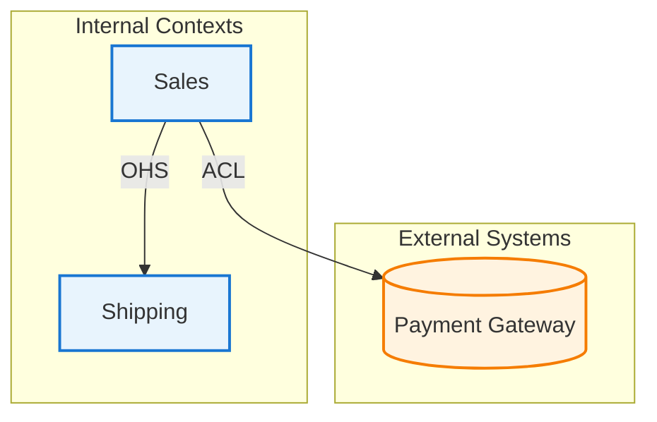

# Bounded Context Mapper

Identify and map bounded contexts through dialogue, generating context maps in Mermaid.

## Input

Optionally reads:
- `docs/modeling/{session}/01-event-storming.md`
- `docs/modeling/{session}/02-aggregates.md`

Can also start fresh.

## Workflow

```
1. Team/Org Review    → Understand team structure
2. Language Analysis  → Identify ubiquitous language boundaries
3. Context Discovery  → Define bounded contexts
4. Relationship Mapping → Define context relationships
5. Integration Points  → Identify integration mechanisms
6. Export             → Generate context map
```

## Session Flow

### Phase 1: Team/Organization Review

Ask:
- 「このドメインに関わる**チーム**はいくつありますか？」
- 「それぞれのチームの**責任範囲**は？」
- 「チーム間の**コミュニケーション頻度**は？」

Conway's Law insight: Team boundaries often align with context boundaries.

### Phase 2: Language Analysis

Ask:
- 「同じ言葉で**異なる意味**を持つものはありますか？」
- 「**Customer**はどの文脈でどういう意味ですか？」
- 「この用語が**最も重要**なのはどのチームですか？」

Capture language variations:
```markdown
## Language Analysis

| Term | Context A Meaning | Context B Meaning |
|------|-------------------|-------------------|
| Customer | 購入者、アカウント情報 | 配送先、連絡先 |
| Product | 販売単位、価格 | 在庫単位、ロケーション |
| Order | 購入トランザクション | 出荷指示 |
```

### Phase 3: Context Discovery

Based on language/team analysis, propose contexts:
- 「以下の境界コンテキストが考えられます」

For each proposed context:
- 「このコンテキストの**主な責任**は何ですか？」
- 「**含まれる集約**はどれですか？」
- 「**除外すべきもの**はありますか？」

### Phase 4: Relationship Mapping

For each context pair:
- 「{Context A}と{Context B}は**データをやり取り**しますか？」
- 「どちらが**上流**（提供側）ですか？」
- 「**依存関係の強さ**はどの程度ですか？」

Present relationship patterns and ask user to select appropriate one.

### Phase 5: Integration Points

Ask:
- 「コンテキスト間の**通信方法**は？（API, イベント, 共有DB）」
- 「**データ変換**は必要ですか？」
- 「**障害時**の影響範囲は？」

## Context Relationship Patterns

| Pattern | Description | Use When |
|---------|-------------|----------|
| **Shared Kernel** | 共有コード/モデル | 密接に協力するチーム |
| **Customer-Supplier** | 上流が下流の要求を考慮 | 協力的な上下関係 |
| **Conformist** | 下流が上流に従う | 上流に影響力なし |
| **Anti-Corruption Layer** | 変換レイヤーで保護 | レガシー/外部システム |
| **Open Host Service** | 公開API/プロトコル | 多数の下流がいる |
| **Published Language** | 標準化された交換形式 | 業界標準がある |
| **Separate Ways** | 統合しない | 統合コストが価値を超える |
| **Partnership** | 相互依存、共同進化 | 成功が相互依存 |

## Output Format

Save to: `docs/modeling/{session}/03-bounded-contexts.md`

```markdown
# Bounded Contexts: {Topic}

Date: {YYYY-MM-DD}

## Context Overview

| Context | Responsibility | Team | Key Aggregates |
|---------|---------------|------|----------------|
| Sales | 販売・注文管理 | Sales Team | Order, Customer |
| Shipping | 配送管理 | Logistics | Shipment, Carrier |
| Inventory | 在庫管理 | Warehouse | Stock, Location |

## Context Definitions

### Sales Context

**Responsibility:** 商品の販売と注文の管理

**Ubiquitous Language:**
- Customer: 購入者（アカウント、購入履歴を持つ）
- Order: 購入トランザクション
- Product: 販売可能な商品単位

**Aggregates:**
- Order
- Customer

**Team:** Sales Team

---

### Shipping Context
{Same structure}

## Context Map

\`\`\`mermaid
flowchart TB
    subgraph Sales["Sales Context"]
        S_Order[Order]
        S_Customer[Customer]
    end

    subgraph Shipping["Shipping Context"]
        SH_Shipment[Shipment]
    end

    subgraph Inventory["Inventory Context"]
        I_Stock[Stock]
    end

    Sales -->|"Customer-Supplier"| Shipping
    Sales -->|"ACL"| Inventory
    Shipping -->|"Conformist"| Inventory
\`\`\`

## Relationship Details

| Upstream | Downstream | Pattern | Integration |
|----------|------------|---------|-------------|
| Sales | Shipping | Customer-Supplier | REST API |
| Inventory | Sales | ACL | Event-driven |
| Inventory | Shipping | Conformist | Shared DB (readonly) |

## Integration Points

### Sales → Shipping
- **Trigger:** OrderPlaced event
- **Data:** Order details, shipping address
- **Protocol:** REST API
- **ACL:** ShippingOrderAdapter

## Anti-Corruption Layers

### Sales-Inventory ACL
**Purpose:** Protect Sales model from Inventory complexity
**Transformations:**
- Inventory.StockItem → Sales.ProductAvailability
- Inventory.Location → (not exposed)

## Open Questions
{Any unresolved items}

## Next Steps
- [ ] Review with all teams
- [ ] Design integration contracts
- [ ] Generate sequence diagrams: `/sequence-diagram`
```

## Mermaid Context Map Styles



## Reference

For detailed relationship patterns and anti-patterns, see [REFERENCE.md](REFERENCE.md).
