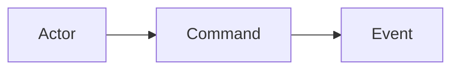
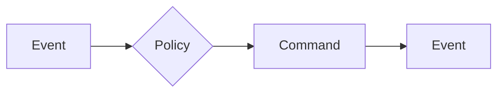
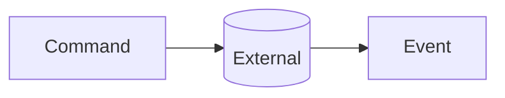
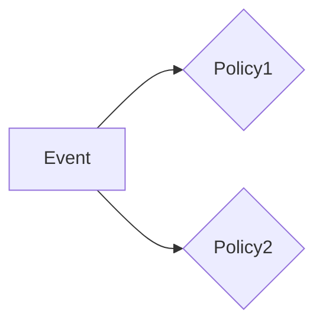
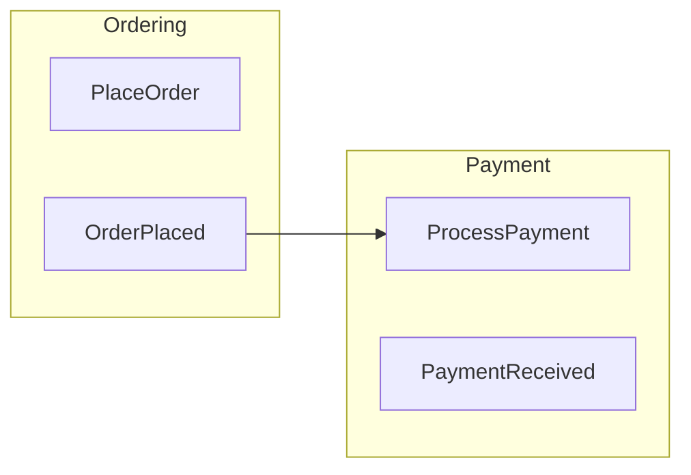

# Event Storming Diagram Generator

Generate Mermaid flowchart diagrams from event storming results with consistent color coding.

## Input

Reads from: `docs/modeling/{session}/01-event-storming.md`

If no session specified, ask user to select or provide path.

## Color Convention

| Element | Color | Mermaid Style |
|---------|-------|---------------|
| Domain Event | Orange | `fill:#FF6B35,color:#fff` |
| Command | Blue | `fill:#4A90D9,color:#fff` |
| Actor | Yellow | `fill:#FFD93D,color:#333` |
| Policy | Purple | `fill:#9B59B6,color:#fff` |
| External System | Pink | `fill:#E91E8C,color:#fff` |
| Aggregate | Green | `fill:#27AE60,color:#fff` |

## Output Format

Save to: `docs/modeling/{session}/01-event-storming-diagram.md`

```markdown
# Event Storming Diagram: {Topic}

Generated from: `01-event-storming.md`

## Flow Diagram

\`\`\`mermaid
flowchart LR
    %% Styles
    classDef event fill:#FF6B35,color:#fff,stroke:#333
    classDef command fill:#4A90D9,color:#fff,stroke:#333
    classDef actor fill:#FFD93D,color:#333,stroke:#333
    classDef policy fill:#9B59B6,color:#fff,stroke:#333
    classDef external fill:#E91E8C,color:#fff,stroke:#333

    %% Actors
    Customer[Customer]:::actor

    %% Flow
    Customer --> PlaceOrder[PlaceOrder]:::command
    PlaceOrder --> OrderPlaced[OrderPlaced]:::event
    OrderPlaced --> SendConfirmation{SendConfirmation}:::policy
    SendConfirmation --> EmailService[(EmailService)]:::external
\`\`\`

## Legend

| Symbol | Meaning |
|--------|---------|
| [Rectangle] | Command |
| [Rectangle]:::event | Domain Event |
| [Actor] | Actor/User |
| {Diamond} | Policy |
| [(Cylinder)] | External System |

## Notes
{Any diagram-specific notes}
```

## Diagram Patterns

### Basic Flow


### Policy Reaction


### External System Integration


### Parallel Flows


## Generation Rules

1. **Read input file** and extract all elements
2. **Determine flow direction**: LR (left-to-right) for linear flows, TB (top-to-bottom) for complex branching
3. **Group related elements** using subgraphs if multiple bounded contexts
4. **Connect elements** following: Actor → Command → Event → (Policy) → Command...
5. **Apply styles** consistently using classDef
6. **Add legend** for clarity

## Node Naming

| Element Type | ID Pattern | Display |
|--------------|------------|---------|
| Event | `evt_{PascalCase}` | `[EventName]` |
| Command | `cmd_{PascalCase}` | `[CommandName]` |
| Actor | `act_{name}` | `[ActorName]` |
| Policy | `pol_{name}` | `{PolicyName}` |
| External | `ext_{name}` | `[(SystemName)]` |

## Subgraph Usage

For multiple contexts or phases:


## Validation

Before saving, verify:
- [ ] All events from input are represented
- [ ] All commands are connected to events
- [ ] Actors are connected to their commands
- [ ] Policies show trigger and result
- [ ] External systems are clearly marked
- [ ] Colors match the convention

## Next Steps

After diagram generation:
- Review with stakeholders for accuracy
- Use `/diagram-feedback` for improvement suggestions
- Proceed to `/aggregate-designer` for aggregate design
