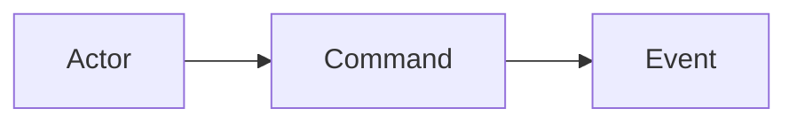
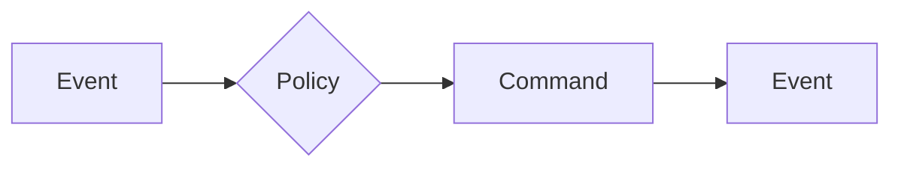
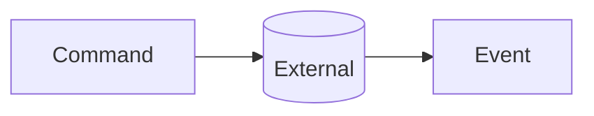
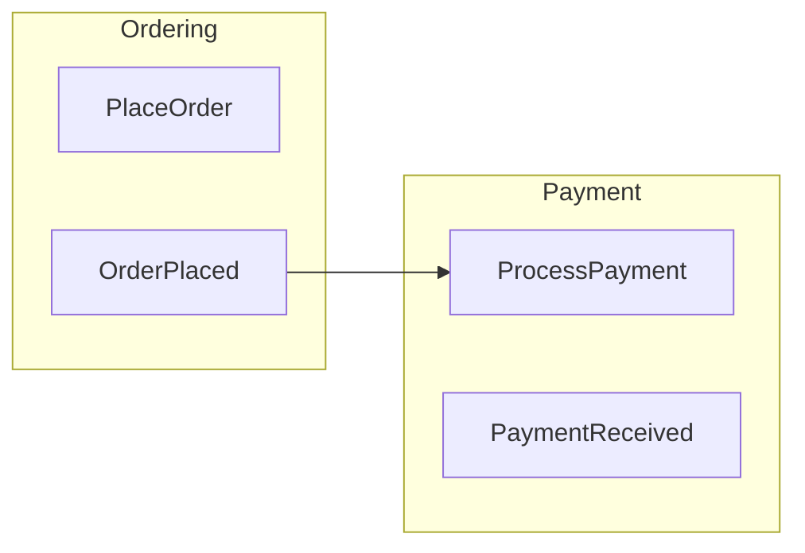

# DDD Modeling Phase 1: Event Storming

イベントストーミングのファシリテーションと図の生成を行うフェーズ1スキル。

## Session Selection

**開始時に必ず実行:**

1. `docs/modeling/` ディレクトリを検索して既存セッションを一覧表示
2. 既存セッションがある場合、ユーザーに選択肢を提示:

```
既存のモデリングセッションが見つかりました:
1. 2024-01-15-order-management (Phase 1完了)
2. 2024-01-10-user-auth (Phase 2まで完了)
3. 新規セッションを開始

どれを選びますか？
```

3. 既存セッション選択時:
   - `01-event-storming.md` が存在する場合:
     - 「続きから編集しますか？それとも最初からやり直しますか？」
     - 続きの場合: ファイルを読み込み、内容を確認して未完了箇所を特定
     - やり直しの場合: 既存ファイルをバックアップ後、新規作成
   - 存在しない場合: 新規作成として Phase 1 を開始

4. 新規セッション選択時:
   - トピック名を確認して `docs/modeling/{YYYY-MM-DD}-{topic}/` を作成

## Workflow

```
1. Context Setup       → ビジネスシナリオ/ドメインの確認
2. Event Discovery     → ドメインイベントの抽出（過去形）
3. Command Mapping     → トリガーとなるコマンドの特定
4. Actor Identification → コマンド発行者の特定
5. Policy & External   → リアクティブポリシー、外部システム
6. Review & Export     → 結果のレビューと保存
7. Diagram Generation  → Mermaidフローチャート図の生成
```

## Output Files

- `docs/modeling/{YYYY-MM-DD}-{topic}/01-event-storming.md`
- `docs/modeling/{YYYY-MM-DD}-{topic}/01-event-storming-diagram.md`

---

## Part 1: Event Storming Facilitation

### Phase 1: Context Setup

Ask the user:
- 「どのビジネスシナリオ/ユースケースを分析しますか？」
- 「関係するステークホルダーは誰ですか？」

Create output directory based on response:
```
docs/modeling/{YYYY-MM-DD}-{topic}/
```

### Phase 2: Event Discovery

Guide with these questions:
- 「このシナリオで**起きる出来事**は何ですか？（過去形で）」
- 「ユーザー視点で、何が**完了した**と言えますか？」
- 「システムが記録すべき**重要な状態変化**は？」

Capture events in format:
```markdown
## Domain Events

| Event | Description | Trigger |
|-------|-------------|---------|
| OrderPlaced | 注文が確定された | Customer |
| PaymentReceived | 支払いが完了した | PaymentGateway |
```

### Phase 3: Command Mapping

For each event, ask:
- 「この{Event}を引き起こす**アクション**は何ですか？」
- 「そのアクションの**入力データ**は？」

Capture commands:
```markdown
## Commands

| Command | Triggers Event | Input Data |
|---------|---------------|------------|
| PlaceOrder | OrderPlaced | items, shippingAddress, paymentMethod |
```

### Phase 4: Actor Identification

Ask:
- 「誰が/何がこのコマンドを発行しますか？」
- 「人間？システム？時間トリガー？」

Actor types:
- **Human**: Customer, Admin, Staff
- **System**: Scheduler, ExternalAPI
- **Time**: Cron, Deadline

### Phase 5: Policy & External Systems

Ask:
- 「{Event}が起きたら、**自動的に**何が起きるべきですか？」
- 「外部システム連携はありますか？」

Capture:
```markdown
## Policies (When-Then)

| When | Then | Notes |
|------|------|-------|
| OrderPlaced | SendConfirmationEmail | Notification service |
| PaymentFailed | NotifyCustomer + CancelOrder | After 3 retries |

## External Systems

| System | Integration Point | Direction |
|--------|------------------|-----------|
| PaymentGateway | ProcessPayment | Outbound |
| InventoryService | CheckStock | Inbound |
```

### Phase 6: Review & Export

Present summary and confirm with user before saving.

#### Output: 01-event-storming.md

```markdown
# Event Storming: {Topic}

Date: {YYYY-MM-DD}
Participants: {list}

## Overview
{Brief description of the analyzed scenario}

## Domain Events
{Table from Phase 2}

## Commands
{Table from Phase 3}

## Actors
{List with descriptions}

## Policies
{Table from Phase 5}

## External Systems
{Table from Phase 5}

## Open Questions
{Any unresolved items for follow-up}

## Next Steps
- [ ] Review with domain experts
- [ ] Proceed to Phase 2: `/ddd-2-aggregate`
```

---

## Part 2: Diagram Generation

After saving 01-event-storming.md, generate the diagram.

### Color Convention

| Element | Color | Mermaid Style |
|---------|-------|---------------|
| Domain Event | Orange | `fill:#FF6B35,color:#fff` |
| Command | Blue | `fill:#4A90D9,color:#fff` |
| Actor | Yellow | `fill:#FFD93D,color:#333` |
| Policy | Purple | `fill:#9B59B6,color:#fff` |
| External System | Pink | `fill:#E91E8C,color:#fff` |
| Aggregate | Green | `fill:#27AE60,color:#fff` |

### Generation Rules

1. **Read input file** and extract all elements
2. **Determine flow direction**: LR (left-to-right) for linear flows, TB (top-to-bottom) for complex branching
3. **Group related elements** using subgraphs if multiple bounded contexts
4. **Connect elements** following: Actor → Command → Event → (Policy) → Command...
5. **Apply styles** consistently using classDef
6. **Add legend** for clarity

### Node Naming

| Element Type | ID Pattern | Display |
|--------------|------------|---------|
| Event | `evt_{PascalCase}` | `[EventName]` |
| Command | `cmd_{PascalCase}` | `[CommandName]` |
| Actor | `act_{name}` | `[ActorName]` |
| Policy | `pol_{name}` | `{PolicyName}` |
| External | `ext_{name}` | `[(SystemName)]` |

### Output: 01-event-storming-diagram.md

```markdown
# Event Storming Diagram: {Topic}

Generated from: `01-event-storming.md`

## Flow Diagram

\`\`\`mermaid
flowchart LR
    %% Styles
    classDef event fill:#FF6B35,color:#fff,stroke:#333
    classDef command fill:#4A90D9,color:#fff,stroke:#333
    classDef actor fill:#FFD93D,color:#333,stroke:#333
    classDef policy fill:#9B59B6,color:#fff,stroke:#333
    classDef external fill:#E91E8C,color:#fff,stroke:#333

    %% Actors
    act_Customer[Customer]:::actor

    %% Flow
    act_Customer --> cmd_PlaceOrder[PlaceOrder]:::command
    cmd_PlaceOrder --> evt_OrderPlaced[OrderPlaced]:::event
    evt_OrderPlaced --> pol_SendConfirmation{SendConfirmation}:::policy
    pol_SendConfirmation --> ext_EmailService[(EmailService)]:::external
\`\`\`

## Legend

| Symbol | Meaning |
|--------|---------|
| [Rectangle] | Command |
| [Rectangle]:::event | Domain Event |
| [Actor] | Actor/User |
| {Diamond} | Policy |
| [(Cylinder)] | External System |

## Notes
{Any diagram-specific notes}
```

### Diagram Patterns

#### Basic Flow


#### Policy Reaction


#### External System Integration


#### Subgraph for Multiple Contexts


---

## Validation Checklist

Before completing:
- [ ] All events identified (past tense, business-meaningful)
- [ ] All commands connected to events
- [ ] Actors identified for each command
- [ ] Policies show trigger and result
- [ ] External systems clearly marked
- [ ] Diagram colors match convention
- [ ] Both files saved

## Facilitation Tips

**Keep momentum:**
- Start with the "happy path" scenario
- Defer edge cases to later passes
- Use "What happens next?" to drive flow

**Resolve conflicts:**
- Different terms for same concept → Pick one, document aliases
- Disagreement on event boundaries → Mark as "needs clarification"

**Signs of good events:**
- Past tense verb + noun (OrderPlaced, not PlaceOrder)
- Business-meaningful (not technical implementation)
- Observable state change

---

## Next Steps

After completing Phase 1:
```
→ Phase 2: /ddd-2-aggregate (集約設計)
→ Phase 3: /ddd-3-context (境界コンテキスト)
→ Phase 4: /ddd-4-model-diagram (クラス図・シーケンス図)
```
