# Class Diagram Generator

Generate Mermaid class diagrams from aggregate definitions with DDD stereotypes.

## Input

Reads from: `docs/modeling/{session}/02-aggregates.md`

Can also work from user-provided entity descriptions.

## Workflow

```
1. Load Aggregates → Read aggregate definitions
2. Classify Elements → AggregateRoot, Entity, Value Object
3. Define Relationships → Composition, association, inheritance
4. Generate Diagram → Create Mermaid class diagram
5. Export → Save to file
```

## DDD Stereotypes

| Stereotype | Meaning | Notation |
|------------|---------|----------|
| `<<AggregateRoot>>` | Entry point to aggregate | Bold border |
| `<<Entity>>` | Has identity, lifecycle | Normal |
| `<<ValueObject>>` | Immutable, no identity | Dashed border |
| `<<DomainService>>` | Stateless domain logic | Italicized |
| `<<Repository>>` | Aggregate persistence | Interface-style |

## Output Format

Save to: `docs/modeling/{session}/05-class-diagram.md`

```markdown
# Class Diagram: {Topic}

Generated: {YYYY-MM-DD}
Source: `02-aggregates.md`

## Domain Model

\`\`\`mermaid
classDiagram
    class Order {
        <<AggregateRoot>>
        -OrderID id
        -CustomerID customerId
        -OrderStatus status
        -Money total
        -List~LineItem~ lineItems
        +addItem(Product, Quantity)
        +removeItem(LineItemID)
        +submit()
        +cancel()
    }

    class LineItem {
        <<Entity>>
        -LineItemID id
        -ProductID productId
        -Quantity quantity
        -Money unitPrice
        +changeQuantity(Quantity)
        +calculateTotal() Money
    }

    class Money {
        <<ValueObject>>
        -Decimal amount
        -Currency currency
        +add(Money) Money
        +multiply(int) Money
    }

    class OrderStatus {
        <<ValueObject>>
        DRAFT
        SUBMITTED
        PAID
        SHIPPED
        CANCELLED
    }

    class Address {
        <<ValueObject>>
        -String street
        -String city
        -String postalCode
        -Country country
    }

    Order *-- LineItem : contains
    Order *-- Money : total
    Order *-- OrderStatus : status
    Order o-- Address : shippingAddress
\`\`\`

## Aggregate Boundaries

\`\`\`mermaid
classDiagram
    namespace OrderAggregate {
        class Order {
            <<AggregateRoot>>
        }
        class LineItem {
            <<Entity>>
        }
    }

    namespace ProductAggregate {
        class Product {
            <<AggregateRoot>>
        }
    }

    Order ..> Product : references by ID
\`\`\`

## Element Catalog

### Aggregate Roots
| Name | Key Methods | Invariants |
|------|-------------|------------|
| Order | addItem, submit, cancel | Has at least 1 item, total matches |

### Entities
| Name | Parent Aggregate | Identity |
|------|-----------------|----------|
| LineItem | Order | LineItemID |

### Value Objects
| Name | Used By | Attributes |
|------|---------|------------|
| Money | Order, LineItem | amount, currency |
| OrderStatus | Order | enum values |

## Notes
{Any diagram-specific notes}
```

## Mermaid Class Syntax

### Basic Class

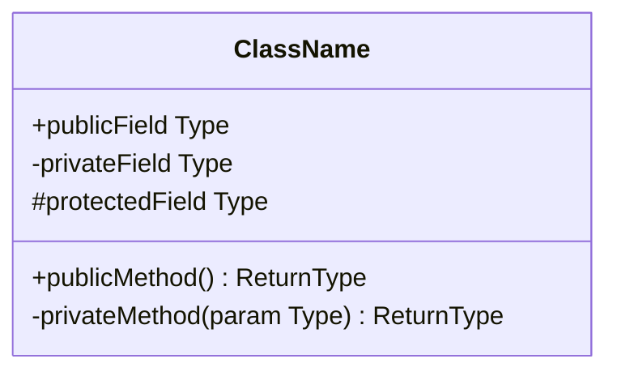

### Stereotypes

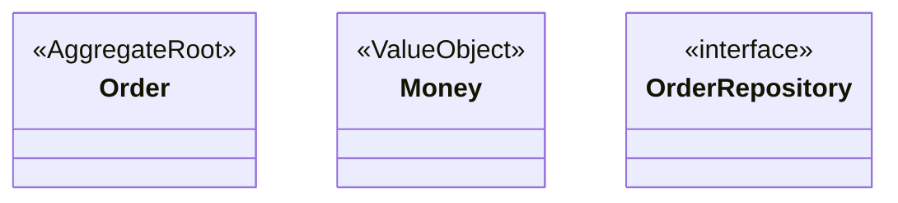

### Relationships

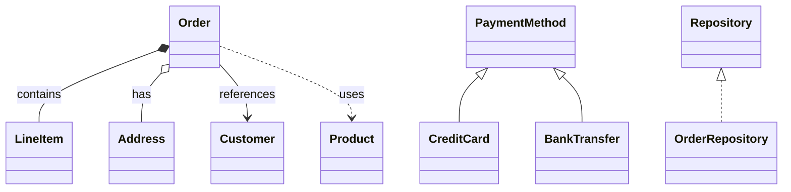

### Cardinality

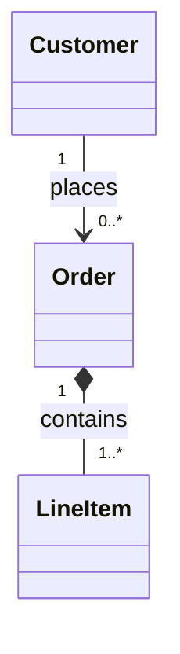

### Namespaces (Aggregate Boundaries)

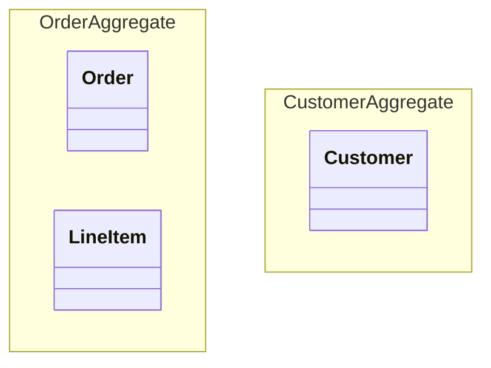

### Notes

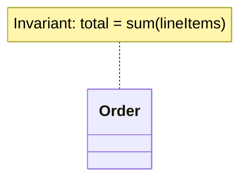

## Styling

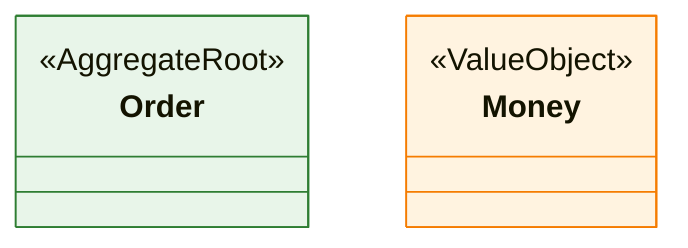

## Common Patterns

### Aggregate Pattern
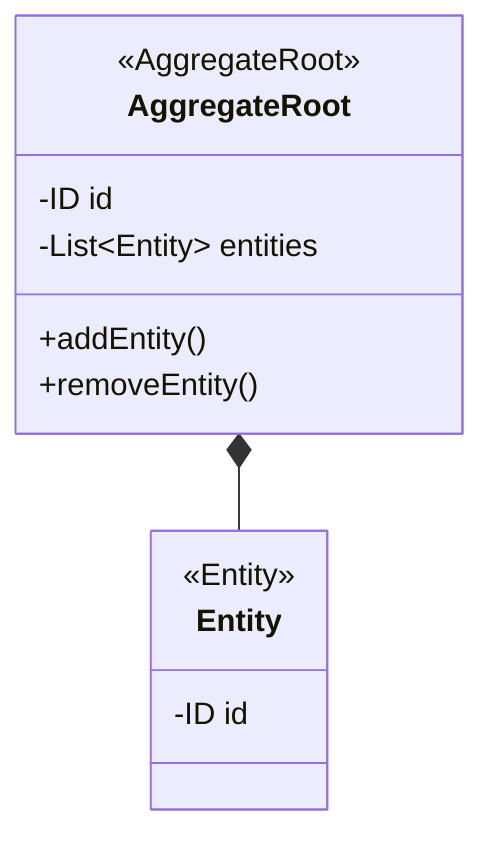

### Value Object Equality
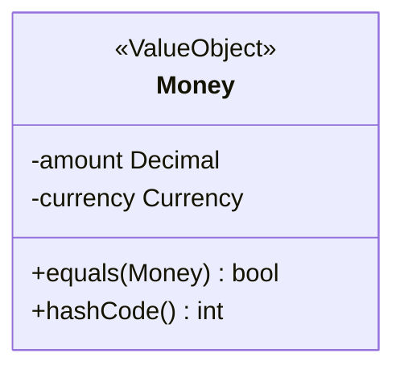

### Enum as Value Object
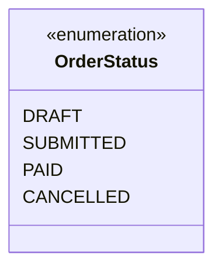

### Repository Interface
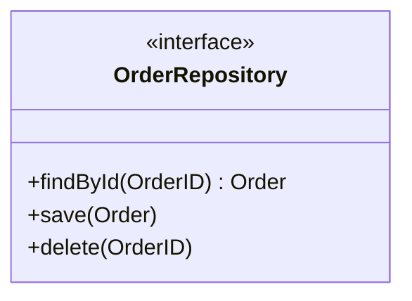

## Validation

Before saving:
- [ ] All aggregates from input represented
- [ ] Stereotypes correctly applied
- [ ] Composition vs association clear
- [ ] Aggregate boundaries visible
- [ ] Cross-aggregate references by ID only (dashed line)
- [ ] Key methods/attributes shown
- [ ] Invariants noted
