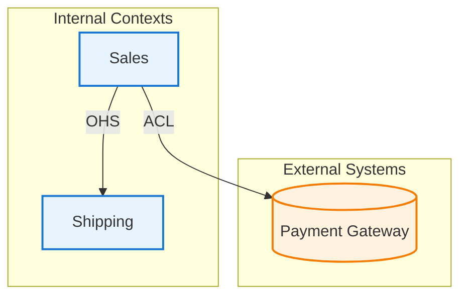

# DDD Modeling Phase 3: Bounded Context Discovery

境界付けられたコンテキスト（Bounded Context）を発見し、コンテキストマップを生成するフェーズ3スキル。

## Session Selection

**開始時に必ず実行:**

1. `docs/modeling/` ディレクトリを検索して既存セッションを一覧表示
2. 既存セッションがある場合、ユーザーに選択肢を提示:

```
既存のモデリングセッションが見つかりました:
1. 2024-01-15-order-management (Phase 2まで完了)
2. 2024-01-10-user-auth (Phase 3まで完了)
3. 新規セッションを開始

どれを選びますか？
```

3. 既存セッション選択時:
   - `01-event-storming.md`, `02-aggregates.md` の有無を確認
   - `03-bounded-contexts.md` が存在する場合:
     - 「続きから編集しますか？それとも最初からやり直しますか？」
     - 続きの場合: ファイルを読み込み、内容を確認して未完了箇所を特定
     - やり直しの場合: 既存ファイルをバックアップ後、新規作成
   - 存在しない場合: 新規作成として Phase 3 を開始

4. 新規セッション選択時:
   - トピック名を確認して `docs/modeling/{YYYY-MM-DD}-{topic}/` を作成
   - Phase 1-2 をスキップして開始することをユーザーに確認

## Prerequisites

Phase 1, 2の出力を読み込み:
- `docs/modeling/{session}/01-event-storming.md`
- `docs/modeling/{session}/02-aggregates.md`

または、ユーザーが提供する情報から開始可能。

## Workflow

```
1. Team/Org Review     → チーム構造の理解
2. Language Analysis   → ユビキタス言語の境界を特定
3. Context Discovery   → 境界コンテキストを定義
4. Relationship Mapping → コンテキスト間の関係を定義
5. Integration Points  → 統合メカニズムを特定
6. Export              → コンテキストマップを生成
```

## Output File

- `docs/modeling/{session}/03-bounded-contexts.md`

---

## Session Flow

### Phase 1: Team/Organization Review

Ask:
- 「このドメインに関わる**チーム**はいくつありますか？」
- 「それぞれのチームの**責任範囲**は？」
- 「チーム間の**コミュニケーション頻度**は？」

Conway's Law insight: Team boundaries often align with context boundaries.

### Phase 2: Language Analysis

Ask:
- 「同じ言葉で**異なる意味**を持つものはありますか？」
- 「**Customer**はどの文脈でどういう意味ですか？」
- 「この用語が**最も重要**なのはどのチームですか？」

### Phase 3: Context Discovery

Based on language/team analysis, propose contexts:
- 「以下の境界コンテキストが考えられます」

For each proposed context:
- 「このコンテキストの**主な責任**は何ですか？」
- 「**含まれる集約**はどれですか？」

### Phase 4: Relationship Mapping

For each context pair:
- 「{Context A}と{Context B}は**データをやり取り**しますか？」
- 「どちらが**上流**（提供側）ですか？」

Present relationship patterns and ask user to select.

### Phase 5: Integration Points

Ask:
- 「コンテキスト間の**通信方法**は？（API, イベント, 共有DB）」
- 「**データ変換**は必要ですか？」

---

## Context Relationship Patterns

| Pattern | Description | Use When |
|---------|-------------|----------|
| **Shared Kernel** | 共有コード/モデル | 密接に協力するチーム |
| **Customer-Supplier** | 上流が下流の要求を考慮 | 協力的な上下関係 |
| **Conformist** | 下流が上流に従う | 上流に影響力なし |
| **Anti-Corruption Layer** | 変換レイヤーで保護 | レガシー/外部システム |
| **Open Host Service** | 公開API/プロトコル | 多数の下流がいる |
| **Published Language** | 標準化された交換形式 | 業界標準がある |
| **Separate Ways** | 統合しない | 統合コストが価値を超える |
| **Partnership** | 相互依存、共同進化 | 成功が相互依存 |

---

## Output Format

Save to `03-bounded-contexts.md` with:
- Context Overview テーブル
- 各コンテキストの定義（Responsibility, Ubiquitous Language, Aggregates）
- Context Map (Mermaid)
- Relationship Details
- Integration Points
- Anti-Corruption Layers (if any)

---

## Mermaid Context Map Example



---

## Validation Checklist

Before completing:
- [ ] All aggregates assigned to a context
- [ ] Ubiquitous language defined per context
- [ ] Relationship patterns selected with rationale
- [ ] Integration points identified
- [ ] ACLs defined where needed
- [ ] Context map diagram generated

---

## Error Handling

### 前提ファイルが存在しない場合
- 「イベントストーミング結果や集約定義が見つかりません」
- ユーザーに直接入力を促すか、先に前フェーズの実行を案内

### 既存セッションの破損
- ファイルが読み込めない場合、バックアップを提案
- 新規作成オプションを提示

---

## References

詳細なガイド:
- 関係パターンとアンチパターン: [references/mapper.md](references/mapper.md)

---

## Next Steps

After completing Phase 3:
```
→ Phase 4: /ddd-modeling:4-model-diagram (クラス図・シーケンス図生成)
```
