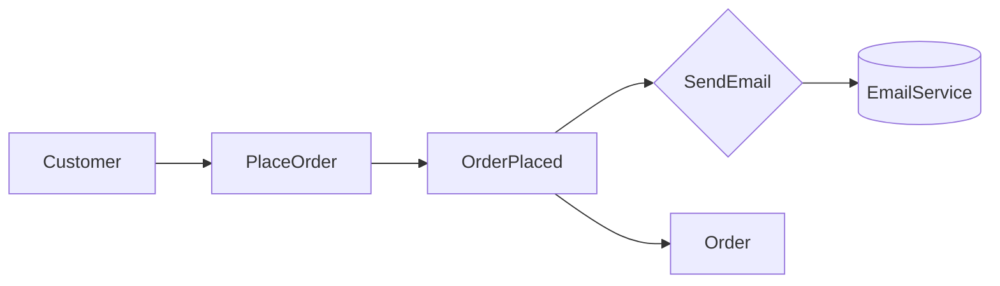
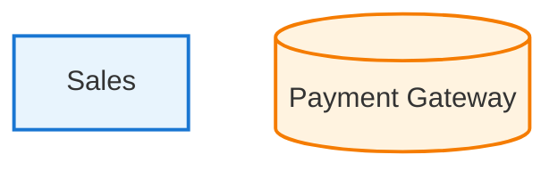

# Mermaid Color Convention

DDDモデリング図で使用する色規約。イベントストーミングおよびその他のMermaid図で一貫して使用。

## Color Palette

| Element | Color | Hex | Mermaid Style |
|---------|-------|-----|---------------|
| Domain Event | Orange | #FF6B35 | `fill:#FF6B35,color:#fff` |
| Command | Blue | #4A90D9 | `fill:#4A90D9,color:#fff` |
| Actor | Yellow | #FFD93D | `fill:#FFD93D,color:#333` |
| Policy | Purple | #9B59B6 | `fill:#9B59B6,color:#fff` |
| External System | Pink | #E91E8C | `fill:#E91E8C,color:#fff` |
| Aggregate | Green | #27AE60 | `fill:#27AE60,color:#fff` |
| Hot Spot / Question | Red | #E74C3C | `fill:#E74C3C,color:#fff` |

## Mermaid classDef Definitions

```mermaid
flowchart LR
    classDef event fill:#FF6B35,color:#fff,stroke:#333
    classDef command fill:#4A90D9,color:#fff,stroke:#333
    classDef actor fill:#FFD93D,color:#333,stroke:#333
    classDef policy fill:#9B59B6,color:#fff,stroke:#333
    classDef external fill:#E91E8C,color:#fff,stroke:#333
    classDef aggregate fill:#27AE60,color:#fff,stroke:#333
    classDef hotspot fill:#E74C3C,color:#fff,stroke:#333
```

## Usage Example



## Sticky Note Analogy

Traditional event storming uses physical sticky notes. This color scheme mirrors that convention:

| Physical | Digital |
|----------|---------|
| Orange sticky | Domain Event node |
| Blue sticky | Command node |
| Yellow sticky | Actor node |
| Purple/Lilac sticky | Policy diamond |
| Pink sticky | External system cylinder |
| Green sticky | Aggregate node |
| Red sticky | Hot spot (unresolved question) |

## Context Map Colors

For bounded context diagrams:

| Element | Mermaid Style |
|---------|---------------|
| Internal Context | `fill:#E8F4FD,stroke:#1976D2,stroke-width:2px` |
| External System | `fill:#FFF3E0,stroke:#F57C00,stroke-width:2px` |



## Class Diagram Colors

For DDD class diagrams:

| Element | Mermaid Style |
|---------|---------------|
| Aggregate Root | `fill:#E8F5E9,stroke:#2E7D32` |
| Value Object | `fill:#FFF3E0,stroke:#F57C00` |
