# DDD Modeling Phase 4: Model Diagrams

集約定義からクラス図とシーケンス図を生成するフェーズ4スキル。

## Session Selection

**開始時に必ず実行:**

1. `docs/modeling/` ディレクトリを検索して既存セッションを一覧表示
2. 既存セッションがある場合、ユーザーに選択肢を提示:

```
既存のモデリングセッションが見つかりました:
1. 2024-01-15-order-management (Phase 2まで完了)
2. 2024-01-10-user-auth (Phase 4まで完了)
3. 新規セッションを開始

どれを選びますか？
```

3. 既存セッション選択時:
   - `02-aggregates.md` の有無を確認（必須の前提ファイル）
   - `04-sequence-*.md`, `05-class-diagram.md` が存在する場合:
     - 「続きから編集しますか？それとも最初からやり直しますか？」
     - 続きの場合: ファイルを読み込み、追加のシナリオや修正を行う
     - やり直しの場合: 既存ファイルをバックアップ後、新規作成
   - 存在しない場合: 新規作成として Phase 4 を開始

4. 新規セッション選択時:
   - トピック名を確認して `docs/modeling/{YYYY-MM-DD}-{topic}/` を作成
   - Phase 1-3 をスキップして開始することをユーザーに確認
   - ただし `02-aggregates.md` がないと図生成は難しいことを警告

## Prerequisites

Phase 1-3の出力を読み込み:
- `docs/modeling/{session}/01-event-storming.md`
- `docs/modeling/{session}/02-aggregates.md`
- `docs/modeling/{session}/03-bounded-contexts.md` (optional)

## Workflow

```
1. Select Scenarios    → シーケンス図を作成するシナリオを選択
2. Generate Sequences  → 各シナリオのシーケンス図を生成
3. Generate Class Diagram → 集約定義からクラス図を生成
4. Export              → ファイルを保存
```

## Output Files

- `docs/modeling/{session}/04-sequence-{usecase}.md` (per scenario)
- `docs/modeling/{session}/05-class-diagram.md`

---

## Part 1: Sequence Diagram Generation

### Step 1: Scenario Selection

If event storming exists:
- 「以下のシナリオが見つかりました。どれを図にしますか？」
- List available scenarios from events

If not:
- 「どのユースケース/シナリオを図にしますか？」

### Step 2: Identify Participants

Ask:
- 「このシナリオに関わる**アクター**は誰ですか？」
- 「関与する**システム/サービス**は何ですか？」

### Step 3: Define Message Flow

For each step:
- 「誰が誰に何を送りますか？」
- 「同期ですか？非同期ですか？」
- 「レスポンスはありますか？」
- 「条件分岐はありますか？」

### Output: 04-sequence-{usecase}.md

```markdown
# Sequence Diagram: {Use Case Name}

Generated: {YYYY-MM-DD}
Scenario: {Brief description}

## Diagram

\`\`\`mermaid
sequenceDiagram
    autonumber

    actor Customer
    participant Web as Web Frontend
    participant API as Order API
    participant Payment as Payment Service
    participant DB as Database

    Customer->>Web: Add items to cart
    Web->>API: POST /cart/items
    API->>DB: Save cart
    DB-->>API: OK
    API-->>Web: Cart updated
    Web-->>Customer: Show updated cart

    Customer->>Web: Checkout
    Web->>API: POST /orders
    API->>DB: Create order (pending)
    API->>Payment: Process payment
    Payment-->>API: Payment result
    alt Payment successful
        API->>DB: Update order (confirmed)
        API-->>Web: Order confirmed
        Web-->>Customer: Show confirmation
    else Payment failed
        API->>DB: Update order (failed)
        API-->>Web: Payment failed
        Web-->>Customer: Show error
    end
\`\`\`

## Participants

| Participant | Type | Description |
|-------------|------|-------------|
| Customer | Actor | End user placing order |
| Web Frontend | System | React SPA |
| Order API | System | Backend API service |
| Payment Service | External | Third-party payment processor |
| Database | System | PostgreSQL |

## Notes
- Payment is synchronous for simplicity
- Consider async payment flow for production

## Related
- Event storming: `01-event-storming.md`
- Aggregates: `02-aggregates.md`
```

### Mermaid Sequence Syntax Reference

#### Basic Messages
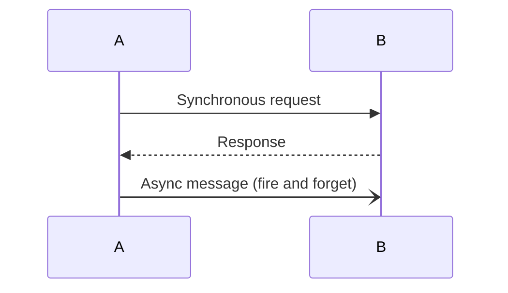

#### Activation (Lifeline)
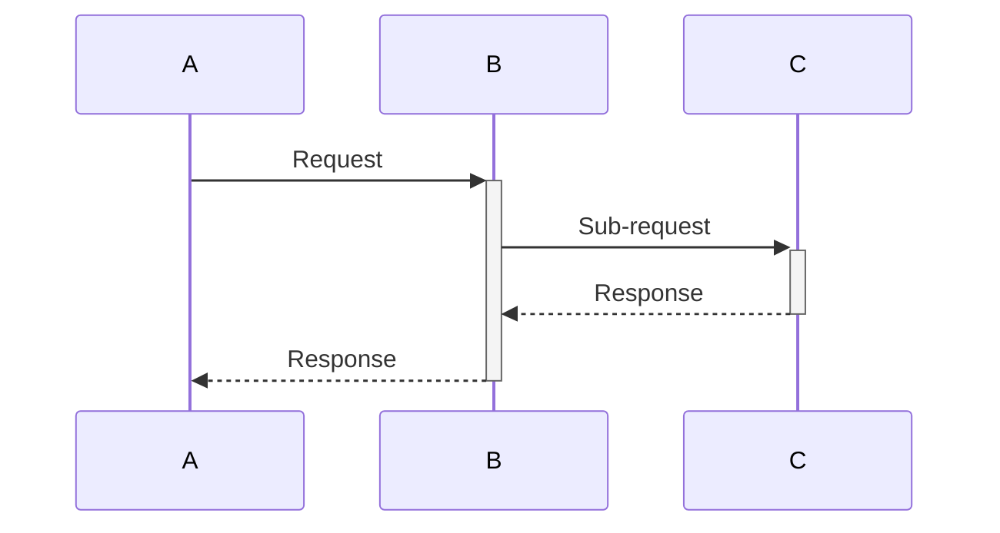

#### Conditionals
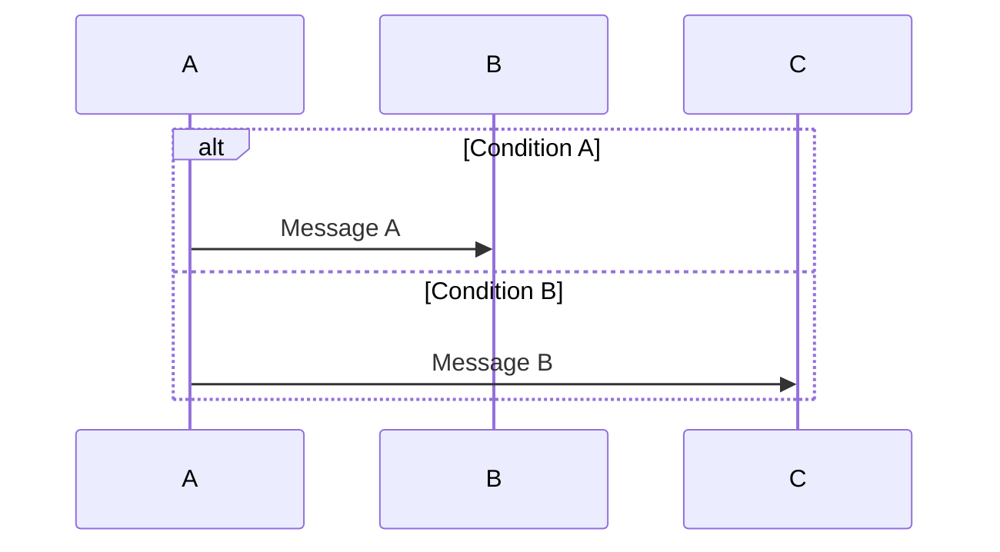

#### Loops
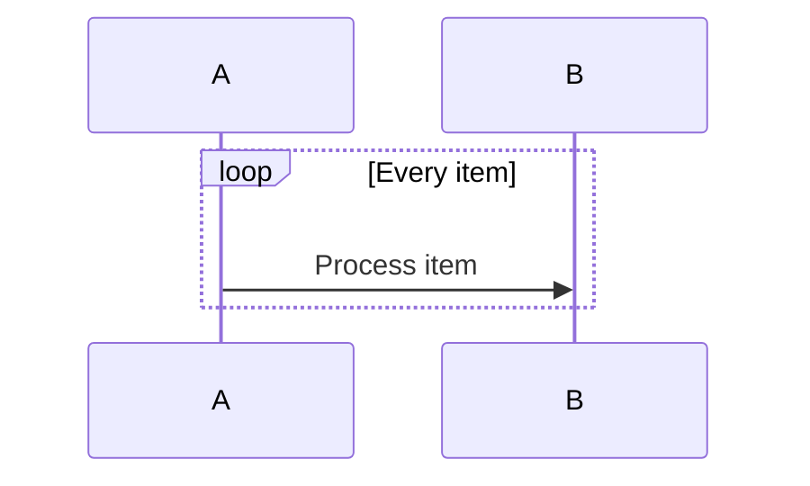

#### Parallel
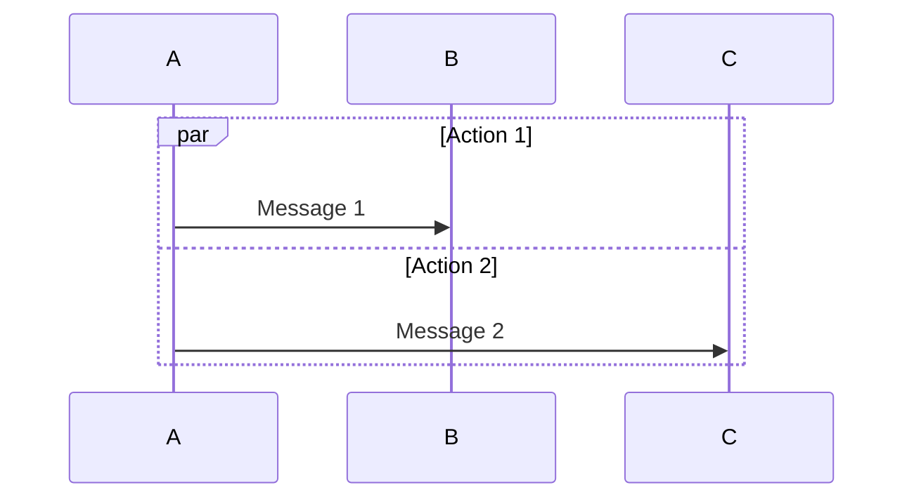

#### Grouping (Box)
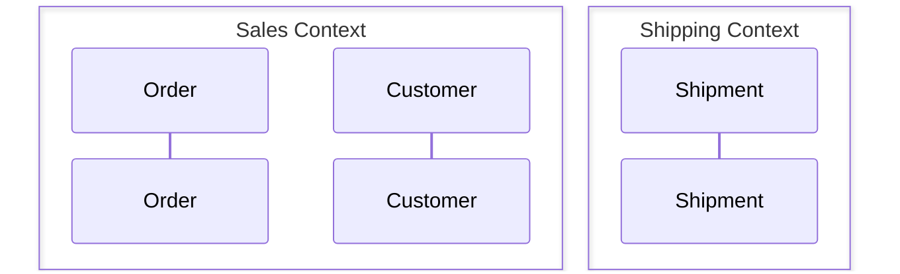

---

## Part 2: Class Diagram Generation

### DDD Stereotypes

| Stereotype | Meaning | Notation |
|------------|---------|----------|
| `<<AggregateRoot>>` | Entry point to aggregate | Bold border |
| `<<Entity>>` | Has identity, lifecycle | Normal |
| `<<ValueObject>>` | Immutable, no identity | Dashed border |
| `<<DomainService>>` | Stateless domain logic | Italicized |
| `<<Repository>>` | Aggregate persistence | Interface-style |

### Generation Process

1. Load aggregate definitions
2. Classify elements: AggregateRoot, Entity, Value Object
3. Define relationships: Composition, association, inheritance
4. Generate Mermaid class diagram

### Output: 05-class-diagram.md

```markdown
# Class Diagram: {Topic}

Generated: {YYYY-MM-DD}
Source: `02-aggregates.md`

## Domain Model

\`\`\`mermaid
classDiagram
    class Order {
        <<AggregateRoot>>
        -OrderID id
        -CustomerID customerId
        -OrderStatus status
        -Money total
        -List~LineItem~ lineItems
        +addItem(Product, Quantity)
        +removeItem(LineItemID)
        +submit()
        +cancel()
    }

    class LineItem {
        <<Entity>>
        -LineItemID id
        -ProductID productId
        -Quantity quantity
        -Money unitPrice
        +changeQuantity(Quantity)
        +calculateTotal() Money
    }

    class Money {
        <<ValueObject>>
        -Decimal amount
        -Currency currency
        +add(Money) Money
        +multiply(int) Money
    }

    class OrderStatus {
        <<ValueObject>>
        DRAFT
        SUBMITTED
        PAID
        SHIPPED
        CANCELLED
    }

    class Address {
        <<ValueObject>>
        -String street
        -String city
        -String postalCode
        -Country country
    }

    Order *-- LineItem : contains
    Order *-- Money : total
    Order *-- OrderStatus : status
    Order o-- Address : shippingAddress
\`\`\`

## Aggregate Boundaries

\`\`\`mermaid
classDiagram
    namespace OrderAggregate {
        class Order {
            <<AggregateRoot>>
        }
        class LineItem {
            <<Entity>>
        }
    }

    namespace ProductAggregate {
        class Product {
            <<AggregateRoot>>
        }
    }

    Order ..> Product : references by ID
\`\`\`

## Element Catalog

### Aggregate Roots
| Name | Key Methods | Invariants |
|------|-------------|------------|
| Order | addItem, submit, cancel | Has at least 1 item, total matches |

### Entities
| Name | Parent Aggregate | Identity |
|------|-----------------|----------|
| LineItem | Order | LineItemID |

### Value Objects
| Name | Used By | Attributes |
|------|---------|------------|
| Money | Order, LineItem | amount, currency |
| OrderStatus | Order | enum values |

## Notes
{Any diagram-specific notes}
```

### Mermaid Class Syntax Reference

#### Basic Class
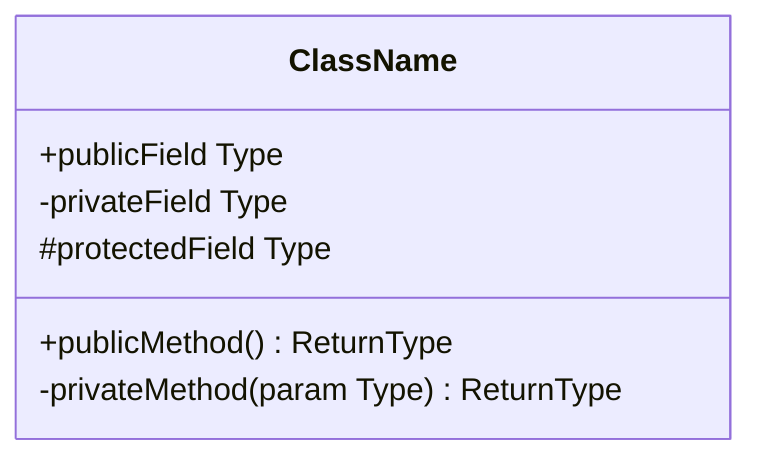

#### Relationships
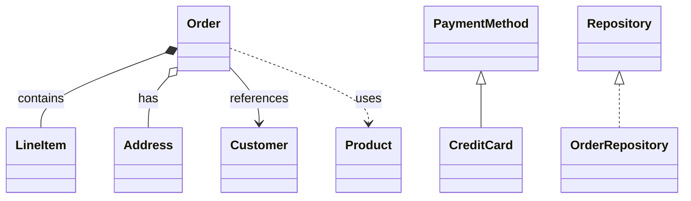

#### Cardinality
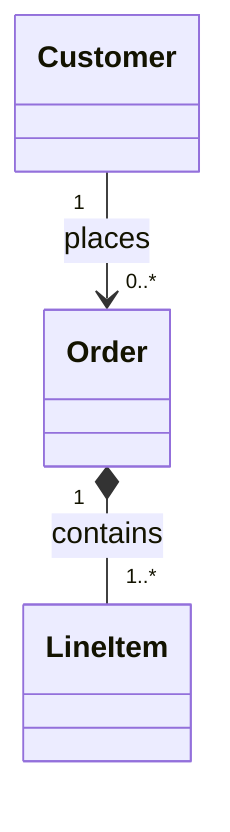

#### Namespaces (Aggregate Boundaries)
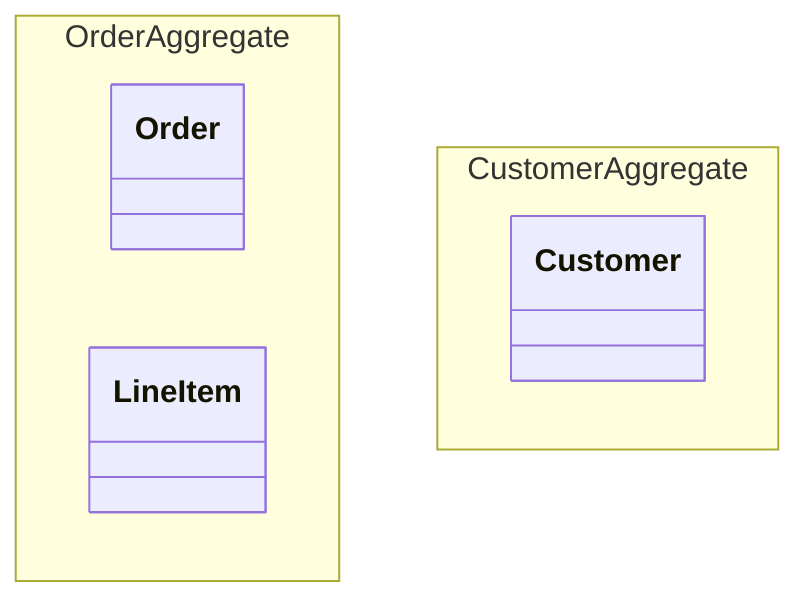

#### Styling
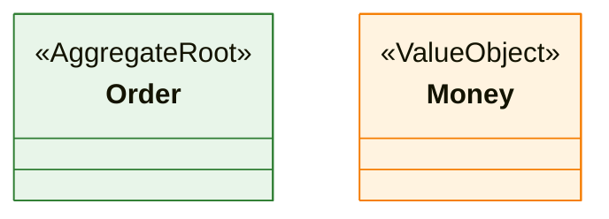

---

## Common Patterns

### Aggregate Pattern
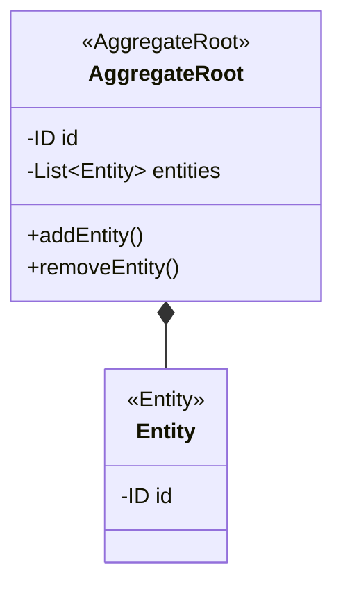

### Saga Pattern (Sequence)
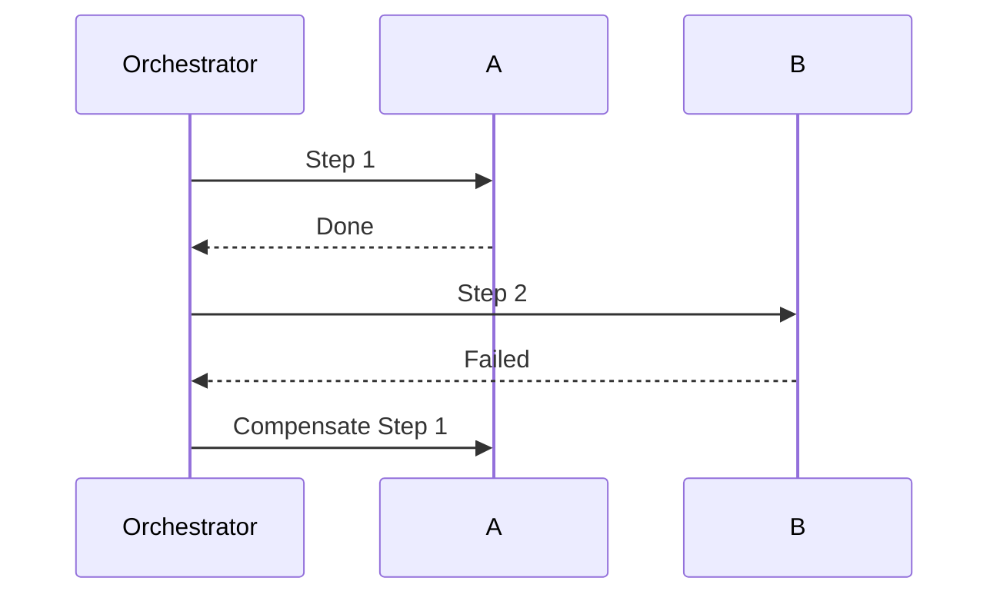

### Event-Driven (Sequence)
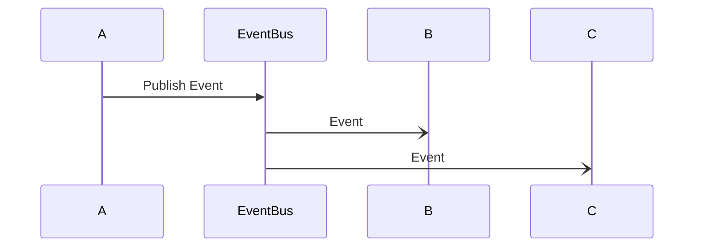

---

## Validation Checklist

### Sequence Diagrams
- [ ] All participants identified
- [ ] Message direction clear (→ vs ←)
- [ ] Sync vs async distinguished
- [ ] Error paths shown (alt/opt)
- [ ] Autonumber for readability
- [ ] Notes explain non-obvious steps

### Class Diagrams
- [ ] All aggregates from input represented
- [ ] Stereotypes correctly applied
- [ ] Composition vs association clear
- [ ] Aggregate boundaries visible
- [ ] Cross-aggregate references by ID only (dashed line)
- [ ] Key methods/attributes shown
- [ ] Invariants noted

---

## Summary

After Phase 4 completion:

```
docs/modeling/{session}/
├── 01-event-storming.md
├── 01-event-storming-diagram.md
├── 02-aggregates.md
├── 03-bounded-contexts.md
├── 04-sequence-{usecase1}.md
├── 04-sequence-{usecase2}.md
└── 05-class-diagram.md
```

## Diagram Review

For feedback on generated diagrams:
- Use `/ddd-modeling:feedback` with the file path
- Get DDD-focused review and improvement suggestions
