# Sequence Diagram Reference

Mermaidシーケンス図生成の詳細ガイド。

## Mermaid Sequence Syntax

### Basic Messages

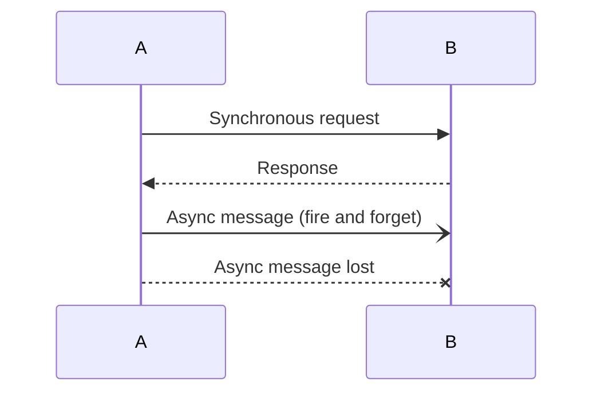

### Activation (Lifeline)

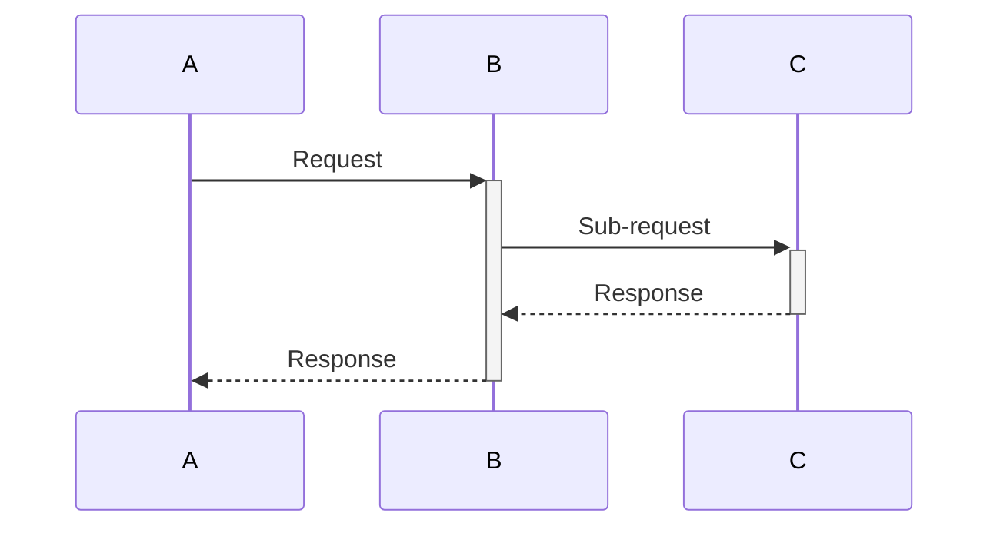

### Conditionals

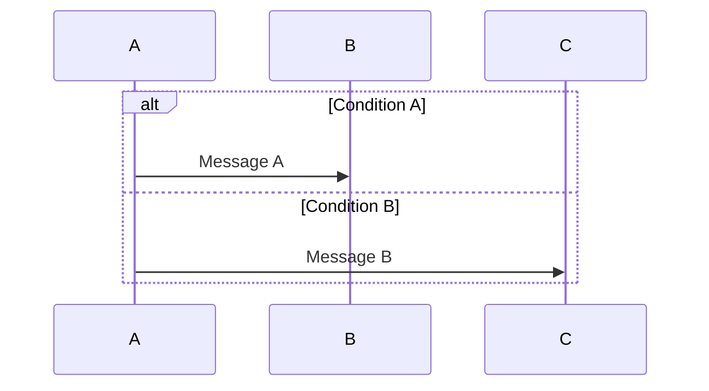

### Loops

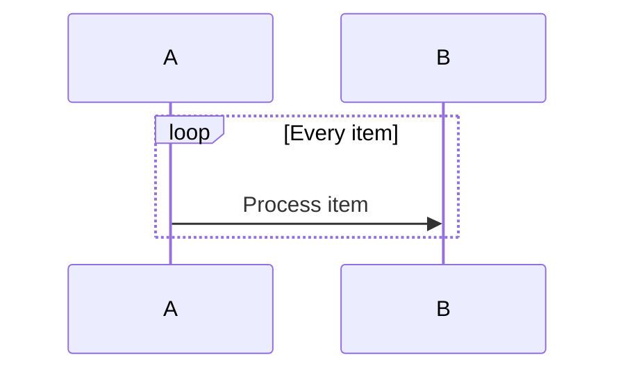

### Optional

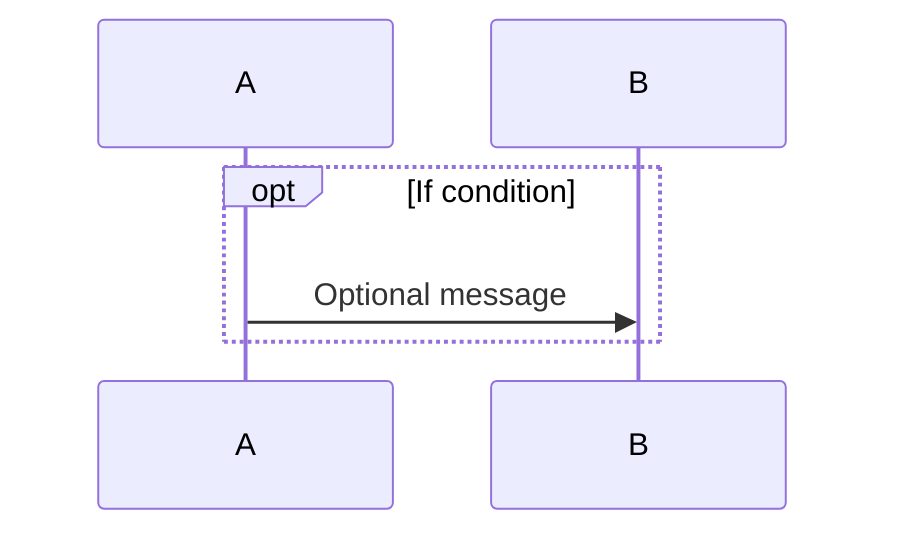

### Parallel

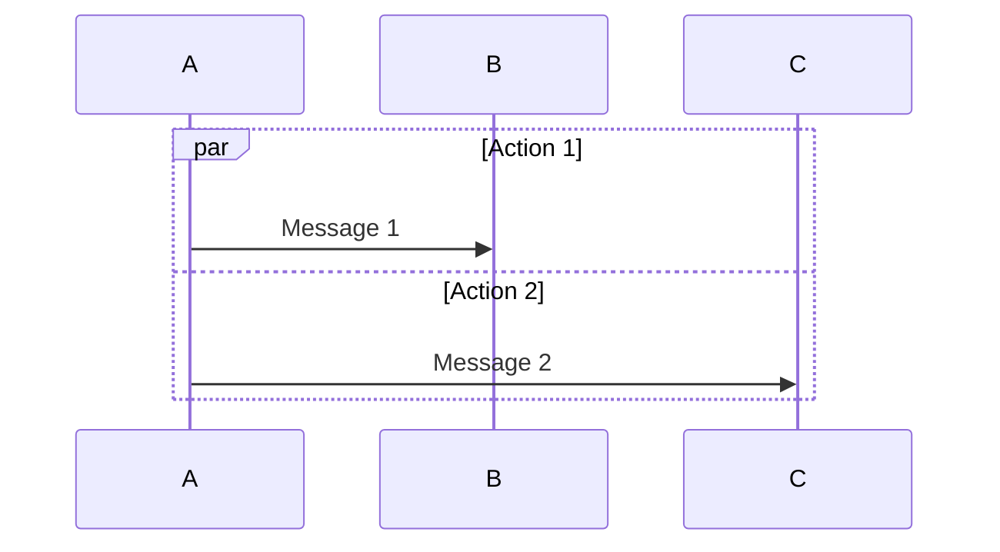

### Notes

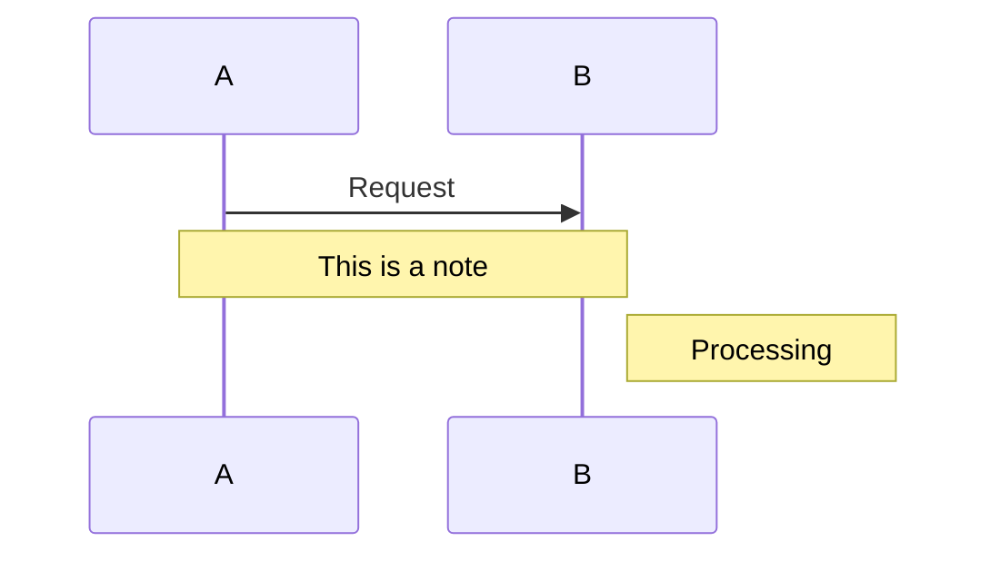

### Grouping (Box)

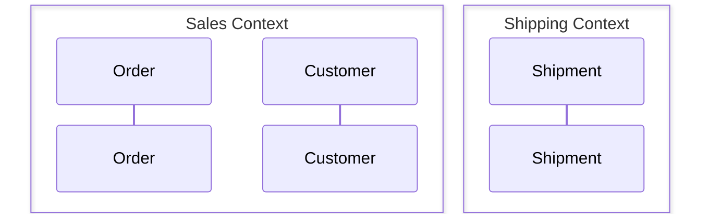

## Common Patterns

### Request-Response
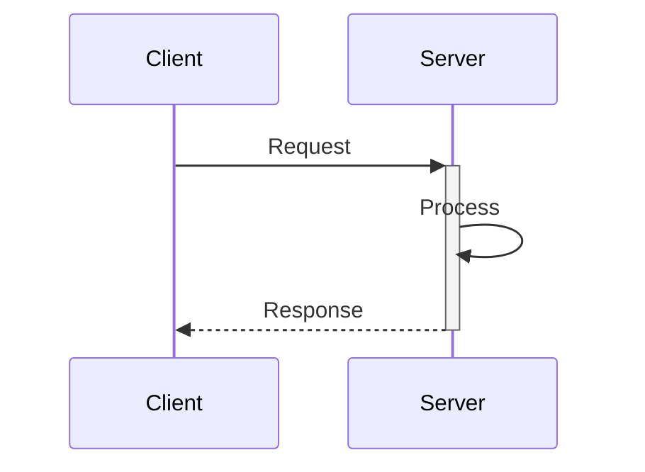

### Event-Driven
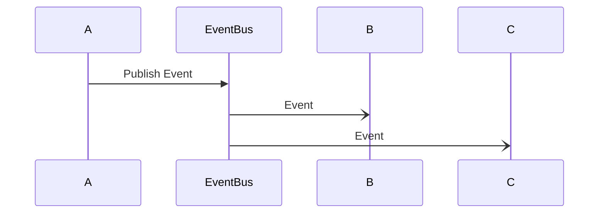

### Saga Pattern
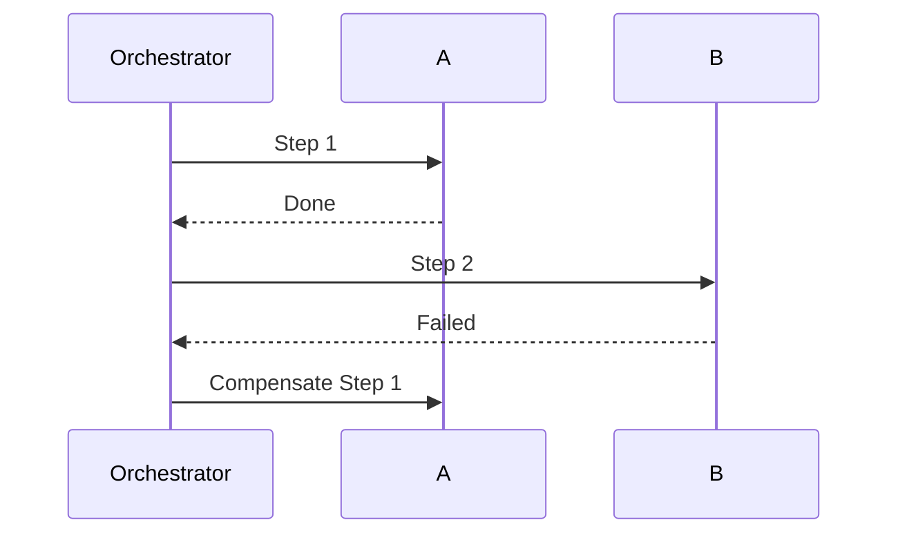

## Output Template

```markdown
# Sequence Diagram: {Use Case Name}

Generated: {YYYY-MM-DD}
Scenario: {Brief description}

## Diagram

\`\`\`mermaid
sequenceDiagram
    autonumber

    actor Customer
    participant Web as Web Frontend
    participant API as Order API
    participant Payment as Payment Service
    participant DB as Database

    Customer->>Web: Add items to cart
    Web->>API: POST /cart/items
    API->>DB: Save cart
    DB-->>API: OK
    API-->>Web: Cart updated
    Web-->>Customer: Show updated cart

    Customer->>Web: Checkout
    Web->>API: POST /orders
    API->>DB: Create order (pending)
    API->>Payment: Process payment
    Payment-->>API: Payment result
    alt Payment successful
        API->>DB: Update order (confirmed)
        API-->>Web: Order confirmed
        Web-->>Customer: Show confirmation
    else Payment failed
        API->>DB: Update order (failed)
        API-->>Web: Payment failed
        Web-->>Customer: Show error
    end
\`\`\`

## Participants

| Participant | Type | Description |
|-------------|------|-------------|
| Customer | Actor | End user placing order |
| Web Frontend | System | React SPA |
| Order API | System | Backend API service |
| Payment Service | External | Third-party payment processor |
| Database | System | PostgreSQL |

## Notes
- Payment is synchronous for simplicity
- Consider async payment flow for production

## Related
- Event storming: `01-event-storming.md`
- Aggregates: `02-aggregates.md`
```

## Validation Checklist

Before saving:
- [ ] All participants identified
- [ ] Message direction clear (→ vs ←)
- [ ] Sync vs async distinguished
- [ ] Error paths shown (alt/opt)
- [ ] Autonumber for readability
- [ ] Notes explain non-obvious steps
