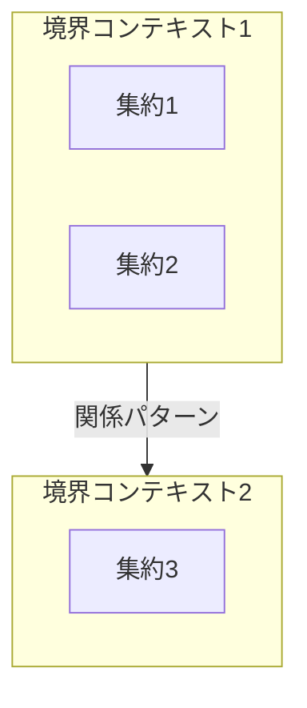

# DDD Modeling Supporter

チームのイベントストーミングの相談相手・アドバイザー。

## Overview

スクリーンショット（ふせんの図）とテキスト（要件/質問）を受け取り、現在のフェーズを自動推測してアドバイスを提供します。

## Input

- **画像**: イベントストーミングのふせん、図のスクリーンショット
- **テキスト**: 要件説明、質問、相談内容

## Workflow

```
1. 画像+テキストを受け取る
2. 現在のフェーズを自動推測
3. 「〇〇のフェーズでよろしいですか？」と確認
4. OKならアドバイスを提供
```

---

## Phase Detection

画像とテキストから以下の5フェーズのいずれかを推測:

| # | フェーズ | 判断基準 |
|---|----------|----------|
| 1 | イベント洗い出し | オレンジのふせん中心、イベント名が並んでいる |
| 2 | フロー図作成 | 矢印で接続、コマンド/ポリシーが含まれる |
| 3 | 集約特定 | 緑のふせん、グループ化されている |
| 4 | 境界コンテキスト決定 | 大きな枠で囲まれている、複数のグループ |
| 5 | ユースケース検証 | フローチャート、永続化の記述 |

**推測後、必ず確認:**
```
「イベント洗い出しフェーズでよろしいですか？」
```

---

## Response by Phase

### Phase 1: イベント洗い出し

**チェックポイント:**
- イベントは過去形か？（OrderPlaced, not PlaceOrder）
- ビジネス視点か？（技術実装ではない）
- 漏れているイベントはないか？
- 重複はないか？
- 失敗ケース/例外ケースは考慮されているか？

**よくある指摘:**
- 「〇〇が成功した場合のイベントはありますが、失敗した場合は？」
- 「〇〇の前に、△△というイベントが必要では？」
- 「〇〇と△△は同じ意味ですか？統合できそうです」

**次のフェーズへの提案:**
- イベントが出揃ったら「フロー図作成に進みましょうか？」

詳細: [references/event-analysis.md](references/event-analysis.md)

### Phase 2: フロー図作成

**チェックポイント:**
- 各イベントのトリガーは明確か？
- フローパターンに沿っているか？
  - アクター起点 / 外部システム起点 / 時間トリガー起点
  - ポリシー経由 / リードモデル経由
- コマンドから集約/外部システムへの接続は排他的か？
- リードモデルは必要な箇所にあるか？

**よくある指摘:**
- 「このイベントのトリガーは何ですか？」
- 「ここはポリシー（自動）ですか？人の判断（リードモデル経由）ですか？」
- 「コマンドから集約と外部システム両方に行っていますが、どちらか一方では？」

**次のフェーズへの提案:**
- フローが整理できたら「集約の特定に進みましょうか？」

詳細: [references/flow-patterns.md](references/flow-patterns.md)

### Phase 3: 集約特定

**チェックポイント:**
- 各集約に明確なルート（エントリポイント）があるか？
- 集約内で不変条件を守れるか？
- 集約サイズは適切か？（小さい方が良い）
- 集約間の参照はIDのみか？

**よくある指摘:**
- 「この2つは同じ集約に含めるべきでは？（同時に更新が必要）」
- 「この集約は大きすぎます。分割を検討しては？」
- 「集約間で直接参照していますが、IDで参照する方が良いです」

**次のフェーズへの提案:**
- 集約が決まったら「境界コンテキストの決定に進みましょうか？」

詳細: [references/aggregate-advice.md](references/aggregate-advice.md)

### Phase 4: 境界コンテキスト決定

**チェックポイント:**
- 同じ言葉が異なる意味で使われていないか？
- チーム/組織構造と整合しているか？
- コンテキスト間の関係は明確か？
- 統合パターン（ACL, OHS等）は適切か？

**よくある指摘:**
- 「"顧客"という言葉が2つのコンテキストで異なる意味で使われていませんか？」
- 「このコンテキストは分割した方が良さそうです」
- 「コンテキスト間の関係はCustomer-Supplierが適切では？」

**Mermaid図の生成:**
- 「コンテキストマップをMermaidで生成しましょうか？」

詳細: [references/context-mapping.md](references/context-mapping.md)

### Phase 5: ユースケース検証

**チェックポイント:**
- ユースケースがスムーズに記述できるか？
- 永続化はシンプルか？（1トランザクション1集約が理想）
- 複数集約の同時更新はないか？
- 集約境界は適切か？

**よくある指摘:**
- 「このステップで2つの集約を同時更新していますが、問題ないですか？」
- 「永続化が複雑になっています。集約の境界を見直しては？」
- 「→ Phase 3に戻って集約を再設計することをお勧めします」

**完了判断:**
- すべてのユースケースがスムーズ → 「モデリング完了です！」
- 問題あり → 「Phase 3に戻って集約を見直しましょう」

詳細: [references/usecase-validation.md](references/usecase-validation.md)

---

## Diagram Generation

コンテキストマップのMermaid図を生成できます。

**生成タイミング:**
- Phase 4 完了時
- ユーザーから「図を作って」とリクエストされた時

**出力形式:**


詳細: [references/context-mapping.md](references/context-mapping.md)

---

## Color Convention

| 要素 | 色 | Mermaid Style |
|------|-----|---------------|
| Domain Event | オレンジ | `fill:#FF6B35,color:#fff` |
| Command | 青 | `fill:#4A90D9,color:#fff` |
| Actor | 黄 | `fill:#FFD93D,color:#333` |
| Policy | 紫 | `fill:#9B59B6,color:#fff` |
| External System | ピンク | `fill:#E91E8C,color:#fff` |
| Aggregate | 緑 | `fill:#27AE60,color:#fff` |
| Read Model | ミントグリーン | `fill:#98D8AA,color:#333` |
| Hot Spot | 赤 | `fill:#E74C3C,color:#fff` |

詳細: [references/color-convention.md](references/color-convention.md)

---

## References

- [references/event-analysis.md](references/event-analysis.md) - Phase 1: イベント分析
- [references/flow-patterns.md](references/flow-patterns.md) - Phase 2: フローパターン
- [references/aggregate-advice.md](references/aggregate-advice.md) - Phase 3: 集約アドバイス
- [references/context-mapping.md](references/context-mapping.md) - Phase 4: コンテキストマップ
- [references/usecase-validation.md](references/usecase-validation.md) - Phase 5: ユースケース検証
- [references/color-convention.md](references/color-convention.md) - 色規約
