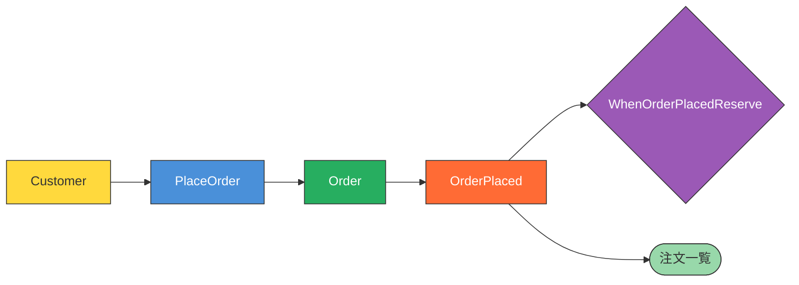

# Color Convention Reference

Mermaid図で使用する色規約。

## Element Colors

| 要素 | 色 | Hex | Mermaid Style |
|------|-----|-----|---------------|
| Domain Event | オレンジ | #FF6B35 | `fill:#FF6B35,color:#fff` |
| Command | 青 | #4A90D9 | `fill:#4A90D9,color:#fff` |
| Actor | 黄 | #FFD93D | `fill:#FFD93D,color:#333` |
| Policy | 紫 | #9B59B6 | `fill:#9B59B6,color:#fff` |
| External System | ピンク | #E91E8C | `fill:#E91E8C,color:#fff` |
| Aggregate | 緑 | #27AE60 | `fill:#27AE60,color:#fff` |
| Read Model | ミントグリーン | #98D8AA | `fill:#98D8AA,color:#333` |
| Hot Spot | 赤 | #E74C3C | `fill:#E74C3C,color:#fff` |

## Mermaid classDef

```mermaid
classDef event fill:#FF6B35,color:#fff,stroke:#333
classDef command fill:#4A90D9,color:#fff,stroke:#333
classDef actor fill:#FFD93D,color:#333,stroke:#333
classDef policy fill:#9B59B6,color:#fff,stroke:#333
classDef external fill:#E91E8C,color:#fff,stroke:#333
classDef aggregate fill:#27AE60,color:#fff,stroke:#333
classDef readmodel fill:#98D8AA,color:#333,stroke:#333
classDef hotspot fill:#E74C3C,color:#fff,stroke:#333
```

## Node Shapes

| 要素 | 形状 | Mermaid記法 |
|------|------|-------------|
| Event | 四角 | `[EventName]` |
| Command | 四角 | `[CommandName]` |
| Actor | 四角 | `[ActorName]` |
| Policy | ひし形 | `{PolicyName}` |
| External System | 円筒 | `[(SystemName)]` |
| Aggregate | 四角 | `[AggregateName]` |
| Read Model | 角丸四角 | `([ReadModelName])` |
| Scheduler | 平行四辺形 | `[/SchedulerName/]` |

## Example Diagram



## Context Map Colors

| 要素 | Mermaid Style |
|------|---------------|
| Internal Context | `fill:#E8F4FD,stroke:#1976D2,stroke-width:2px` |
| External System | `fill:#FFF3E0,stroke:#F57C00,stroke-width:2px` |

## Sticky Note Analogy

| Physical | Digital |
|----------|---------|
| Orange sticky | Domain Event |
| Blue sticky | Command |
| Yellow sticky | Actor |
| Purple sticky | Policy |
| Pink sticky | External System |
| Green sticky | Aggregate |
| Light green sticky | Read Model |
| Red sticky | Hot Spot |
