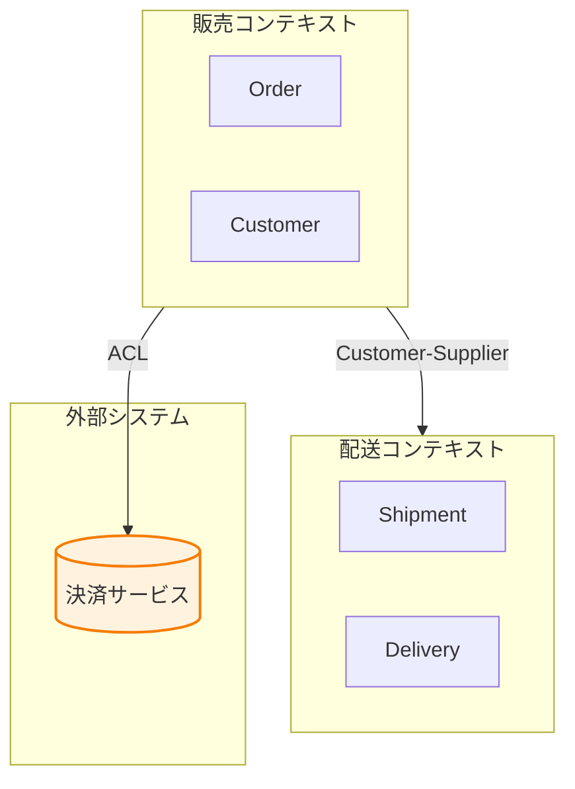

# Context Mapping Reference

Phase 4: 境界コンテキスト決定フェーズの詳細ガイド。

## Bounded Context Basics

**境界コンテキストとは:**
- ユビキタス言語の境界
- 同じ言葉が同じ意味を持つ範囲
- チーム/組織構造と整合することが多い

## Context Discovery

### 言語の境界を見つける

**同じ言葉、異なる意味:**

| 言葉 | 販売コンテキスト | 配送コンテキスト |
|------|-----------------|-----------------|
| 顧客 | 購入者、支払い情報 | 届け先、連絡先 |
| 商品 | 価格、在庫 | サイズ、重量 |
| 注文 | 支払い状態 | 配送状態 |

### チーム構造を確認

Conway's Law: システム構造はチーム構造を反映する

**質問:**
- 「このドメインに関わるチームはいくつ？」
- 「それぞれの責任範囲は？」

## Relationship Patterns

| パターン | 説明 | 使う場面 |
|----------|------|----------|
| Shared Kernel | 共有コード/モデル | 密接に協力するチーム |
| Customer-Supplier | 上流が下流を考慮 | 協力的な上下関係 |
| Conformist | 下流が上流に従う | 上流に影響力なし |
| Anti-Corruption Layer | 変換レイヤーで保護 | レガシー/外部システム |
| Open Host Service | 公開API | 多数の下流がいる |
| Published Language | 標準化された形式 | 業界標準がある |
| Separate Ways | 統合しない | 統合コストが高い |
| Partnership | 相互依存 | 成功が相互依存 |

## Mermaid Context Map

**基本テンプレート:**

**関係パターンの表記:**
- `-->|"パターン名"|` で関係を示す
- 矢印の向き: 上流 → 下流

## Questions to Ask

**言語確認:**
- 「同じ言葉で異なる意味を持つものはありますか？」
- 「この用語が最も重要なのはどのチームですか？」

**境界確認:**
- 「この集約たちは同じコンテキストですか？」
- 「別のチームが担当するものはありますか？」

**関係確認:**
- 「コンテキスト間でデータをやり取りしますか？」
- 「どちらが上流（提供側）ですか？」

## Phase Completion Criteria

- [ ] すべての集約がコンテキストに割り当て済み
- [ ] ユビキタス言語がコンテキストごとに定義
- [ ] 関係パターンが選択済み
- [ ] コンテキストマップ図が生成済み

**完了したら:**
「コンテキストマップができました。ユースケース検証（Phase 5）に進みましょうか？」
