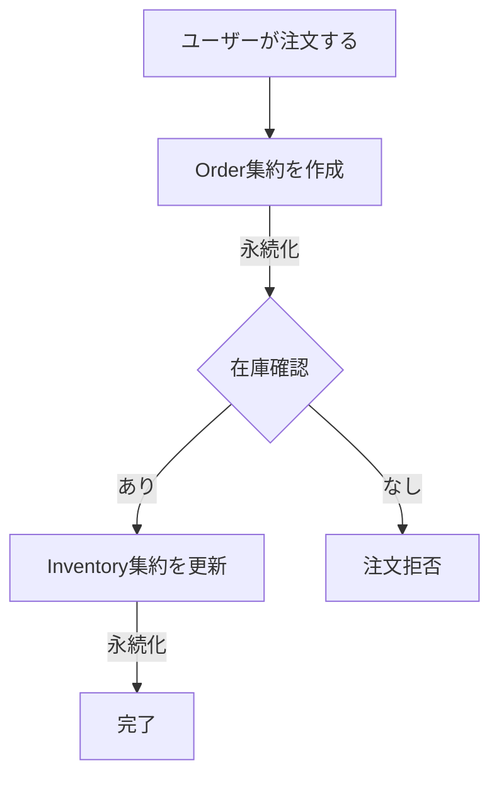

# Usecase Validation Reference

Phase 5: ユースケース検証フェーズの詳細ガイド。

## Purpose

集約設計の妥当性を検証する。問題があればPhase 3に戻る。

## Validation Flow

```
1. ユースケースを選択
2. フローチャートで流れを描く
3. 各ステップの永続化を確認
4. 検証観点でチェック
5. 問題あり → Phase 3へ / 問題なし → 完了
```

## Validation Criteria

### 1. フローのスムーズさ

**Good:**
- 自然な言葉でステップを説明できる
- 各ステップの責任が明確

**Bad:**
- 「ここでAとBを同時に...」という説明が必要
- ステップの順序が不自然

### 2. 永続化のシンプルさ

**Good:**
- 1ステップで1集約のみ更新
- 結果整合性で十分な箇所は非同期

**Bad:**
- 1トランザクションで複数集約を更新
- 複雑な2フェーズコミットが必要

### 3. 集約境界の適切さ

**Good:**
- 集約内で完結する操作が多い
- 集約間の依存が少ない

**Bad:**
- 頻繁に複数集約をまたぐ操作
- 集約間の循環依存

## Common Issues

### Issue 1: 複数集約の同時更新

**症状:**
```
Step 1: Orderを作成
Step 2: Orderを保存 & Inventoryを更新  ← 問題！
```

**解決:**
- 集約を統合する
- イベント駆動で結果整合性に

### Issue 2: 複雑なトランザクション

**症状:**
- 「AとBとCを同時に更新しないと...」

**解決:**
- サガパターンを検討
- 集約境界を見直し

## Flowchart Template



## Questions to Ask

**フロー確認:**
- 「このユースケースのステップを順番に教えてください」
- 「各ステップでどの集約が関係しますか？」

**永続化確認:**
- 「このステップで永続化される集約は何ですか？」
- 「1つのトランザクションで複数の集約を更新していませんか？」

## Phase Completion

**問題がある場合:**
```
検証結果: 要改善

問題点:
1. OrderとInventoryを同時に更新している

推奨アクション:
→ Phase 3に戻って集約を見直しましょう
```

**問題がない場合:**
```
検証結果: OK

すべてのユースケースがスムーズに記述でき、
永続化もシンプルです。

モデリング完了です！
最終成果物として、コンテキストマップを生成しますか？
```
