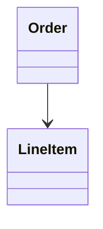

# DDD Modeling Skills Test Scenarios

各スキルの動作検証シナリオ

## テスト環境セットアップ

```bash
# プラグインインストール確認
claude mcp list
# → ddd-modeling が表示されること
```

---

## Scenario 1: Phase 1 - Event Storming (/ddd-modeling:1-event-storming)

### 1.1 基本起動テスト

**Input:**
```
/ddd-modeling:1-event-storming ECサイトの注文フロー
```

**Expected:**
1. ビジネスシナリオの確認質問が表示される
2. 対話形式でイベント抽出が進む
3. `docs/modeling/YYYY-MM-DD-ecommerce-order/01-event-storming.md` が生成される
4. `docs/modeling/YYYY-MM-DD-ecommerce-order/01-event-storming-diagram.md` が生成される

**Verify:**
- ファイルに Domain Events テーブルがある
- Commands テーブルがある
- Actors セクションがある
- Policies セクションがある
- External Systems セクションがある
- Mermaid フローチャート図が生成されている

### 1.2 対話フロー検証

**Dialogue Flow:**
1. 「ECサイトの注文フロー」→ シナリオ確認
2. 「顧客が商品をカートに入れて注文する」→ イベント抽出開始
3. イベント回答 → コマンド質問
4. コマンド回答 → アクター質問
5. アクター回答 → ポリシー質問
6. 完了 → ファイル保存 → 図生成

### 1.3 色規約テスト

**Verify Mermaid output:**
```mermaid
classDef event fill:#FF6B35,color:#fff
classDef command fill:#4A90D9,color:#fff
classDef actor fill:#FFD93D,color:#333
classDef policy fill:#9B59B6,color:#fff
classDef external fill:#E91E8C,color:#fff
```

---

## Scenario 2: Phase 2 - Aggregate Design (/ddd-modeling:2-aggregate)

### 2.1 基本起動テスト

**Input:**
```
/ddd-modeling:2-aggregate
```

**Expected:**
1. 既存 event storming の読み込み、または新規開始の選択
2. 対話形式で不変条件を探る
3. `02-aggregates.md` が生成される

**Verify:**
- Aggregates Overview テーブルがある
- 各集約に Root Entity が明示されている
- Invariants セクションがある
- Lifecycle セクションがある

### 2.2 不変条件対話

**Expected Questions:**
- 「{Entity}について、常に真でなければならないルールは何ですか？」
- 「{Entity A}と{Entity B}は同じトランザクションで更新される必要がありますか？」

---

## Scenario 3: Phase 3 - Bounded Context (/ddd-modeling:3-context)

### 3.1 基本起動テスト

**Input:**
```
/ddd-modeling:3-context
```

**Expected:**
1. チーム構成の確認質問
2. ユビキタス言語の分析
3. コンテキストマップ Mermaid 生成
4. `03-bounded-contexts.md` が生成される

**Verify:**
- Context Overview テーブルがある
- 各コンテキストの Ubiquitous Language が定義されている
- Context Map が Mermaid で描かれている
- Relationship Details テーブルがある

### 3.2 関係パターン検証

**Expected relationship options:**
- Shared Kernel
- Customer-Supplier
- Conformist
- Anti-Corruption Layer
- Open Host Service
- Published Language
- Separate Ways
- Partnership

---

## Scenario 4: Phase 4 - Model Diagrams (/ddd-modeling:4-model-diagram)

### 4.1 シーケンス図生成

**Prerequisites:**
- `01-event-storming.md` が存在

**Input:**
```
/ddd-modeling:4-model-diagram
```

**Expected:**
1. シナリオ選択（既存から or 新規指定）
2. 参加者の特定
3. Mermaid sequence diagram 生成
4. `04-sequence-{usecase}.md` が生成される

**Verify:**
- `sequenceDiagram` 構文が正しい
- autonumber が含まれる
- 参加者リストがある

### 4.2 クラス図生成

**Prerequisites:**
- `02-aggregates.md` が存在

**Expected:**
1. 集約定義を読み込む
2. DDD ステレオタイプ付きクラス図生成
3. `05-class-diagram.md` が生成される

**Verify:**
- `<<AggregateRoot>>` ステレオタイプがある
- `<<Entity>>` ステレオタイプがある
- `<<ValueObject>>` ステレオタイプがある
- 集約境界が namespace で示されている
- 関係（composition, aggregation, dependency）が正しい

### 4.3 ステレオタイプ検証

**Expected in output:**
```mermaid
class Order {
    <<AggregateRoot>>
}
class LineItem {
    <<Entity>>
}
class Money {
    <<ValueObject>>
}
```

---

## Scenario 5: Diagram Feedback (/ddd-modeling:feedback)

### 5.1 Mermaid ファイルへのフィードバック

**Input:**
```
/ddd-modeling:feedback docs/modeling/2025-01-15-order/05-class-diagram.md
```

**Expected:**
1. ファイルを読み込む
2. DDD 原則の観点で分析
3. 構造化されたフィードバックを出力

**Verify:**
- Summary セクション（Overall Assessment）
- Category スコア（DDD Principles, Clarity, Naming, Completeness）
- Strengths セクション
- Issues Found セクション（具体的な問題と修正提案）

### 5.2 画像へのフィードバック

**Input:**
```
/ddd-modeling:feedback /path/to/diagram-screenshot.png
```

**Expected:**
- 画像を分析
- 視覚的に確認できる要素についてフィードバック

### 5.3 インラインコードへのフィードバック

**Input:**
````
/ddd-modeling:feedback

````

**Expected:**
- Missing stereotypes を指摘
- 関係タイプ（→ vs *--）の改善提案

---

## End-to-End Scenario

### 完全フロー検証（フェーズスキルのみを使用）

**Step 1:** Phase 1 - イベントストーミング
```
/ddd-modeling:1-event-storming ECサイトの注文管理
```
→ 対話完了後、`01-event-storming.md` と `01-event-storming-diagram.md` が生成

**Step 2:** Phase 2 - 集約設計
```
/ddd-modeling:2-aggregate
```
→ 対話完了後、`02-aggregates.md` が生成

**Step 3:** Phase 3 - 境界コンテキスト
```
/ddd-modeling:3-context
```
→ 対話完了後、`03-bounded-contexts.md` が生成

**Step 4:** Phase 4 - モデル図生成
```
/ddd-modeling:4-model-diagram
```
→ シーケンス図とクラス図が生成（`04-sequence-*.md`, `05-class-diagram.md`）

**Step 5:** フィードバック
```
/ddd-modeling:feedback docs/modeling/{session}/05-class-diagram.md
```
→ 改善提案を出力

### 検証ポイント

1. **ファイル連携**: 後続フェーズが前フェーズのファイルを正しく読み込む
2. **出力ディレクトリ**: 全ファイルが同じセッションディレクトリに保存される
3. **一貫性**: 用語・命名が全ファイルで一貫している
4. **Mermaid 構文**: 全図が正しくレンダリングされる

---

## Error Handling Scenarios

### E1: 前提ファイルが存在しない

**Input:**
```
/ddd-modeling:4-model-diagram
```
（02-aggregates.md が存在しない状態）

**Expected:**
- エラーメッセージではなく、新規入力を促す
- 「集約定義が見つかりません。直接定義を入力するか、先に /ddd-modeling:2-aggregate を実行してください」

### E2: 不正なファイルパス

**Input:**
```
/ddd-modeling:feedback /nonexistent/file.md
```

**Expected:**
- ファイルが見つからない旨を通知
- インラインコードの入力を促す

---

## Performance Notes

- 大規模なイベントストーミング（50+ イベント）でも対応可能
- Mermaid 図が複雑になりすぎる場合は分割を提案
- 対話ターン数の目安: 各フェーズ 5-10 ターン

---

## 注意事項

### ユーザー向けスキル（フェーズスキル）

以下のスキルはユーザーが直接呼び出すことを想定:
- `/ddd-modeling:1-event-storming` - Phase 1
- `/ddd-modeling:2-aggregate` - Phase 2
- `/ddd-modeling:3-context` - Phase 3
- `/ddd-modeling:4-model-diagram` - Phase 4
- `/ddd-modeling:feedback` - 補助スキル

### 内部スキル（直接呼び出し非推奨）

以下のスキルはフェーズスキルから内部的に呼び出される:
- `event-storming-facilitator`
- `event-storming-diagram`
- `aggregate-designer`
- `bounded-context-mapper`
- `sequence-diagram`
- `class-diagram`

※ 内部スキルは直接呼び出さず、対応するフェーズスキルを使用してください。
